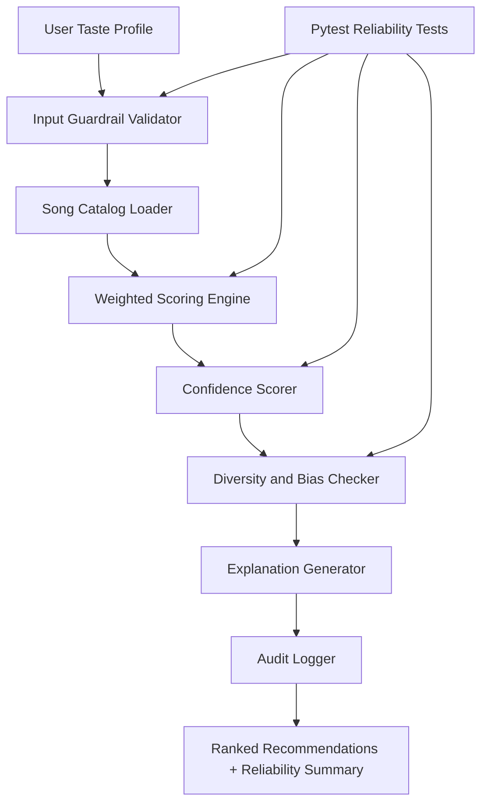
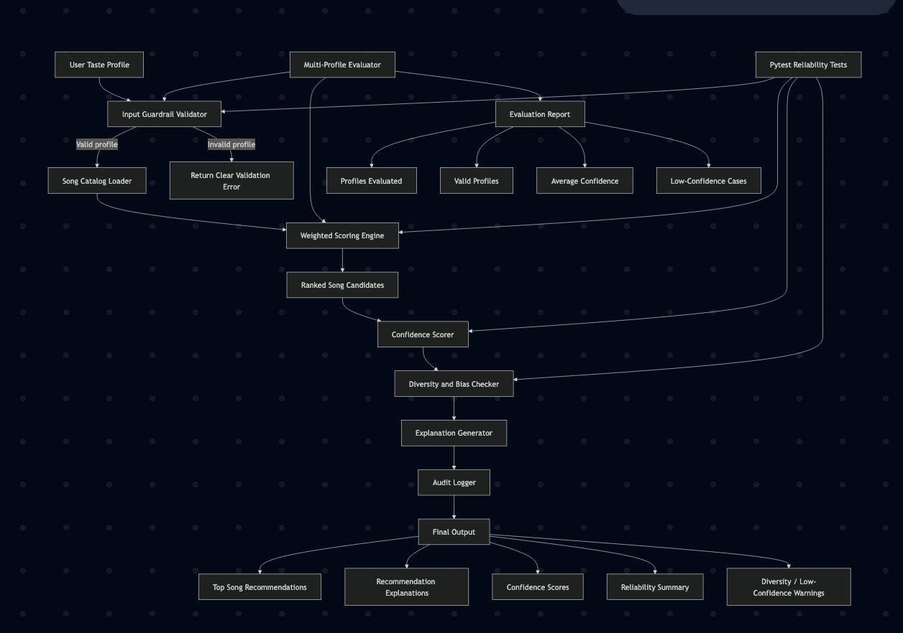

# Explainable Music Recommendation Reliability System

## Original Project

**Original project:** Module 3 Music Recommender Simulation.

The original project was a small content-based recommender that loaded a song catalog, scored songs against a user taste profile, ranked the top matches, and printed explanation text for each recommendation. Its goal was to show how simple AI-style recommendation logic can be made transparent through weighted scoring and human-readable explanations.

## Final Project Summary

This final version extends the original recommender into an applied AI system with an integrated **reliability and testing layer**. The system now recommends songs, explains each score, validates user inputs with guardrails, calculates confidence scores, checks for diversity risks, logs each run to a JSONL audit file, and evaluates reliability across multiple user profiles.

The project matters because recommendation systems can quietly shape user behavior. This version makes the recommender more trustworthy by showing not only *what* it recommends, but also *why*, *how confident it is*, and *where the output may be weak*.

## Advanced AI Feature Used

**Advanced feature:** Reliability and Testing System.

This feature is integrated directly into the main recommendation flow. When the recommender runs, it does not only output ranked songs. It also returns:

- per-song confidence scores
- input guardrail status
- average and lowest confidence
- diversity warnings
- structured audit logs
- multi-profile reliability evaluation

## Architecture Overview





### Data Flow

1. The user profile specifies preferred genre, mood, target energy, and acoustic preference.
2. The guardrail validator rejects invalid inputs before scoring.
3. The catalog loader reads `data/songs.csv`.
4. The scoring engine ranks every song using weighted content-based filtering.
5. The confidence scorer normalizes each score from `0.0` to `1.0`.
6. The diversity checker flags repeated artists, repeated genres, or low-confidence results.
7. The explanation generator describes why each song matched or missed the user's profile.
8. The audit logger records the run in `logs/recommendation_audit.jsonl`.
9. The CLI prints recommendations and an overall reliability report.

## How the Recommender Works

The recommender uses content-based filtering. It compares song features against the user's stated preferences.

### Song Features

Each song includes:

- `genre`
- `mood`
- `energy`
- `tempo_bpm`
- `valence`
- `danceability`
- `acousticness`

### User Profile

Each user profile includes:

- `genre` or `favorite_genre`
- `mood` or `favorite_mood`
- `energy` or `target_energy`
- `likes_acoustic`

### Scoring Formula

```text
Final Score = (3.0 × genre_match)
            + (2.0 × mood_match)
            + (1.5 × energy_similarity)
            + (0.5 × acoustic_preference)
```

Maximum score is `7.0`.

Confidence is calculated as:

```text
confidence = score / 7.0
```

## Guardrails

The system validates user profiles before scoring.

| Field | Rule |
|---|---|
| `favorite_genre` / `genre` | Must be a non-empty string |
| `favorite_mood` / `mood` | Must be a non-empty string |
| `target_energy` / `energy` | Must be between `0.0` and `1.0` |
| `likes_acoustic` | Must be a boolean |
| `k` | Must be a positive integer |
| song catalog | Empty catalog returns a warning instead of crashing |

## Setup Instructions

### 1. Clone or open the project

```bash
cd applied-ai-system-final
```

### 2. Create a virtual environment

```bash
python -m venv .venv
source .venv/bin/activate
```

Windows PowerShell:

```powershell
.venv\Scripts\Activate.ps1
```

### 3. Install dependencies

```bash
pip install -r requirements.txt
```

### 4. Run the main system

```bash
python -m src.main
```

### 5. Run tests

```bash
pytest
```

## Sample Interactions

### Example 1: Chill Lofi Listener

Input profile:

```python
{
    "genre": "lofi",
    "mood": "chill",
    "energy": 0.40,
    "likes_acoustic": True
}
```

Sample output:

```text
1. Library Rain
   Score: 6.86/7.0
   Confidence: 0.98
   Explanation:
   - Genre match: lofi (+3.0)
   - Mood match: chill (+2.0)
   - Energy match: 0.35 (target 0.40) (+1.43)
   - Acoustic preference: 0.86 (+0.43)
```

### Example 2: Workout Enthusiast

Input profile:

```python
{
    "genre": "pop",
    "mood": "intense",
    "energy": 0.92,
    "likes_acoustic": False
}
```

Sample output:

```text
1. Gym Hero
   Score: 6.96/7.0
   Confidence: 0.99
   Explanation:
   - Genre match: pop (+3.0)
   - Mood match: intense (+2.0)
   - Energy match: 0.93 (target 0.92) (+1.48)
   - Electronic preference: 0.05 (+0.47)
```

### Example 3: Reliability Summary

```text
RELIABILITY SUMMARY:
  • Guardrails: passed
  • Average confidence: 0.72
  • Lowest confidence: 0.49
  • Diversity warning: genre 'pop' appears 3/5 times.
  • Low-confidence warning: at least one recommendation scored below 0.60 confidence.
```

## Logging

Each recommendation run writes a JSONL audit record to:

```text
logs/recommendation_audit.jsonl
```

Example log entry:

```json
{
  "timestamp": "2026-04-25T00:00:00+00:00",
  "profile": {
    "favorite_genre": "lofi",
    "favorite_mood": "chill",
    "target_energy": 0.4,
    "likes_acoustic": true
  },
  "top_recommendation": "Library Rain",
  "average_confidence": 0.84,
  "lowest_confidence": 0.68,
  "guardrail_status": "passed",
  "warnings": [],
  "recommendation_count": 5
}
```

Logging errors are handled safely. If the log file cannot be written, the recommender prints a warning but still returns recommendations.

## Testing Summary

Automated tests are in `tests/test_recommender.py`.

The tests cover:

- valid recommendation flow
- sorted recommendation order
- non-empty explanation output
- confidence scores between `0.0` and `1.0`
- invalid energy rejection
- empty catalog behavior
- invalid `k` rejection

Current expected result:

```text
6 tests passing
```

The main reliability run evaluates 8 user profiles. In the latest run, all 8 profiles passed guardrails. Average confidence was approximately `0.72`, and the system flagged lower-confidence profiles where the small catalog lacked enough matching songs.

## Design Decisions

### Why content-based filtering?

The original project already used a transparent content-based scoring model. I kept this approach because it is easier to explain, debug, and evaluate than a black-box model.

### Why confidence scoring?

A ranked list alone can look authoritative even when the match is weak. Confidence scoring makes uncertainty visible and helps users know when the recommender is stretching.

### Why JSONL audit logging?

JSONL is simple, append-only, and readable. It gives a lightweight audit trail without requiring a database.

### Why not use fine-tuning?

Fine-tuning would be excessive for a 20-song classroom dataset. The project goal is reliability and explainability, so a transparent scoring model is more appropriate.

### Trade-offs

- The system is explainable but less flexible than a real recommender trained on user behavior.
- The dataset is small, so confidence can drop for niche profiles.
- Mood matching is exact rather than semantic, so related moods like `chill` and `relaxed` do not partially match.

## Limitations, Bias, and Misuse

### Limitations and Biases

1. **Small catalog bias:** The system only has 20 songs, so rare genres have fewer good matches.
2. **Genre overweighting:** Genre has the highest weight, which can create filter bubbles.
3. **Binary mood matching:** Mood either matches or does not match. There is no partial credit for similar moods.
4. **No listening history:** The system does not learn from skips, likes, or repeated behavior.
5. **No cultural or language context:** The system does not understand lyrics, artist background, or user identity.

### Possible Misuse

A recommender like this could be misused if it were presented as objectively knowing a user's taste. It could also narrow user exposure by repeatedly recommending the same genres or artists.

Prevention steps:

- show confidence scores
- show explanations
- log reliability warnings
- flag repeated genres or artists
- avoid claiming the system understands the user's full musical identity

## Reflection

### What surprised me during reliability testing?

The main surprise was that simple weighted scoring produced realistic recommendations for strong-profile cases, especially lofi/chill and pop/intense users. The weakness appeared when the catalog had limited representation. In those cases, confidence dropped and diversity warnings became more important.

### What did this project teach me about AI and problem-solving?

It showed that reliability is not only about making the output look good. A useful AI system should expose uncertainty, reject bad inputs, and make its reasoning inspectable. The same recommendation can feel very different when the system shows a confidence score and an explanation.

### Collaboration with AI

AI was helpful when suggesting that I add confidence scoring and audit logging, because those features directly matched the final rubric and made the recommender more trustworthy. One flawed AI suggestion was to consider heavier AI features like RAG or fine-tuning; after reviewing the project scope, that would have added complexity without improving this small recommender. The better design choice was an integrated reliability layer.

## Additional Experiments

### Weight Sensitivity

Run:

```bash
python -m src.main_experiment
```

This compares the baseline scoring weights against a mood-focused configuration.

### Diversity Demonstration

Run:

```bash
python -m src.main_diversity
```

This shows how repeated artist or genre penalties can change the top recommendations.

## Project Files

| File | Purpose |
|---|---|
| `src/recommender.py` | Core scoring, guardrails, confidence, logging, and reliability logic |
| `src/main.py` | Main CLI app and multi-profile reliability run |
| `src/main_experiment.py` | Weight sensitivity experiment |
| `src/main_diversity.py` | Diversity penalty experiment |
| `tests/test_recommender.py` | Automated tests |
| `data/songs.csv` | Song catalog |
| `model_card.md` | Detailed model card and reflection |
| `PROFILE_COMPARISON_ANALYSIS.md` | Additional profile comparison notes |
